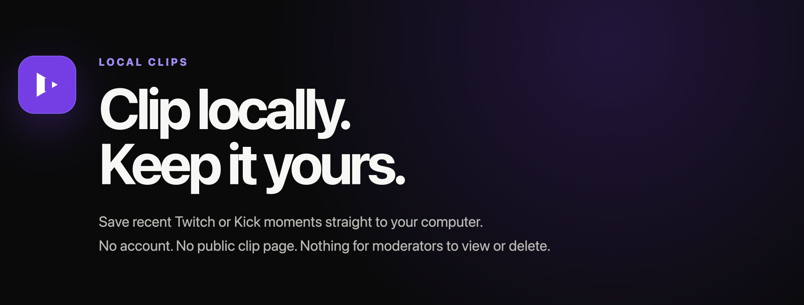

<div align="center">



### Private livestream clips, saved directly to your computer.

**No account · No public clip page · No uploads · No moderator access**

[Install](#install-in-30-seconds) · [How to clip](#make-a-clip) · [How it works](#how-it-works) · [FAQ](#faq)

</div>

---

## Install in 30 seconds

1. **Download this repository** as a ZIP and extract it.
2. Open [`chrome://extensions`](chrome://extensions) in Chrome.
3. Turn on **Developer mode** in the top-right corner.
4. Click **Load unpacked** and select the extracted `local-clips` folder.
5. Pin **Local Clips** to the toolbar.

> The correct folder is the one containing `manifest.json`.

## Make a clip

| 1. Watch | 2. Wait | 3. Click |
| --- | --- | --- |
| Open a live stream on **Twitch** or **Kick** and play it normally. | The purple badge counts up and turns green when your clip window is ready. | Click **Local Clips** once, then choose where Chrome should save the video. |

That's it. Your clip is saved as one original-quality `.ts` video that only you control.

On **Kick**, you can also rewind the live player and click Local Clips there. The extension detects the backwards jump from HLS media-sequence numbers, without reading Kick's seek bar or player UI.

### Choose your clip length

Right-click the extension icon → **Options** → choose between **15 seconds and 5 minutes**. The default is **90 seconds**.

## Why Local Clips?

- **Truly local** — the finished clip exists on your computer, not a platform clip page.
- **Private by default** — moderators and other viewers cannot see or delete your local file.
- **No account required** — no sign-up, API key, or connection to another service.
- **Nothing uploaded** — video moves directly from the stream CDN to your chosen folder.
- **Original quality** — segments are joined without transcoding.
- **One click** — no start/stop recording workflow.

## How it works

When a Twitch or Kick stream opens, Local Clips reads its live HLS playlist and imports any older `.ts` segments the stream still advertises. This can make part or all of the clip window available immediately. As playback continues, it remembers each newly requested segment address and timestamp. It does **not** keep a second copy of the video in extension storage.

For Kick rewind, Local Clips follows the player's HLS playlist changes. Kick normally switches from a rolling live playlist with short segments to a dated `EVENT` playlist whose archive segments are longer. Local Clips indexes each playlist's media sequences, real `EXTINF` durations, program timestamps, and IVS prefetch URLs. A backwards switch starts an isolated rewind-local clip window; switching back to the rolling playlist resets the live buffer from the first confirmed live segment. If an archive request arrives before its playlist can be indexed, MPEG-TS timestamps provide a timing fallback.

When you click the toolbar button, it:

1. Selects the segments inside your configured clip window. On a rewound Kick stream, it selects around the detected HLS sequence anchor and elapsed playback time.
2. Fetches those segments directly from the stream CDN.
3. Verifies the MPEG-TS presentation timestamps form one contiguous playback run, discarding an earlier live-edge run if Kick switched positions.
4. Joins them as a single MPEG transport-stream `Blob` without re-encoding.
5. Opens Chrome's **Save As** dialog.

Recent metadata lives in Chrome's in-memory session storage. It is removed when the tab closes, when the tab leaves Twitch/Kick, or when the browser session ends. Entries older than the rolling retention window are pruned automatically.

## FAQ

<details>
<summary><strong>Why does Local Clips save a <code>.ts</code> file?</strong></summary>

MPEG transport-stream segments can normally be concatenated without transcoding. This keeps clip creation quick and preserves the source video and audio quality. VLC, IINA, mpv, Chrome, and most video tools can play `.ts` files.

</details>

<details>
<summary><strong>Can it clip time from before I opened the stream?</strong></summary>

Sometimes. Local Clips prefills the buffer from older segments still listed in the live HLS playlist. On Kick, you can also use the player's rewind bar. When the player begins requesting an older media sequence, Local Clips uses that segment as the rewind anchor and tries to fill the configured window from the active playlist. If Kick no longer lists the earlier history, only the requested rewind-local segments are available.

</details>

<details>
<summary><strong>What happens if I rewind a Kick stream and then click?</strong></summary>

Local Clips compares requested `.ts` files with the media sequence and durations in Kick's HLS playlist. A backwards jump starts a fresh rewind anchor; returning to the newest sequence restores the normal live buffer. The badge and download are calculated from real `EXTINF` durations rather than a fixed seconds-per-request guess.

Kick's IVS worker knows the sub-segment seek timestamp, but normal Chrome extensions cannot read a worker's DevTools console output without the intrusive debugger permission. Local Clips therefore stays network-only and works to MPEG-TS segment-boundary precision.

</details>

<details>
<summary><strong>Does it record or store the entire stream?</strong></summary>

No. Before you click, the extension stores only recent segment URLs and timestamps. The selected video data exists temporarily in memory while Chrome prepares the download, and the merged Blob URL is released shortly after the download starts.

</details>

<details>
<summary><strong>Why does Chrome request access to HTTPS websites?</strong></summary>

Twitch and Kick deliver video through changing third-party CDN hosts. Host access lets Local Clips observe and fetch those segment URLs. The listener ignores stream requests unless their tab is on `twitch.tv` or `kick.com`.

</details>

<details>
<summary><strong>Can I save MP4 instead?</strong></summary>

Not yet. MP4 output requires a media remuxer and would make the extension materially larger. The current `.ts` output avoids that overhead and keeps the source quality intact.

</details>

## Current support

| Supported | Not yet supported |
| --- | --- |
| Twitch and Kick live HLS streams using unencrypted `.ts` segments | Fragmented MP4 (`.m4s`) streams |
| Clip windows from 15 seconds to 5 minutes | Encrypted HLS streams |
| Immediate prefill from older segments still listed by the live playlist | History already removed from the platform playlist |
| Network-detected clipping after rewinding a Kick livestream | Sub-segment cutting or history Kick no longer lists |
| One clip at a time per tab | Automatic MP4 remuxing |

## Development

No dependency installation is required.

```bash
npm test
npm run check
```

After changing extension code, click **Reload** for Local Clips on `chrome://extensions`, then reload the Twitch or Kick tab to start a fresh rolling buffer.

---

<div align="center">

**Your clip. Your drive. Your rules.**

</div>
